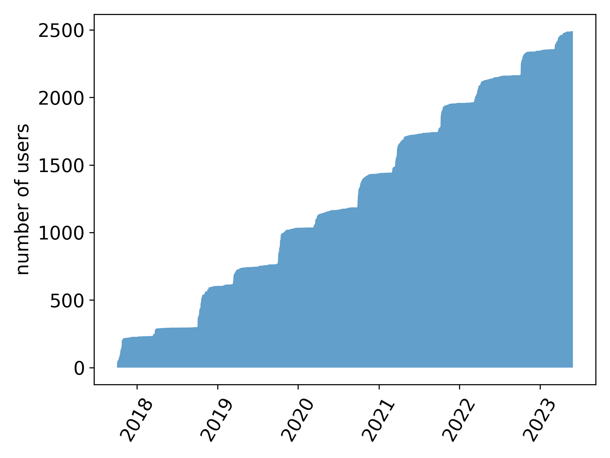
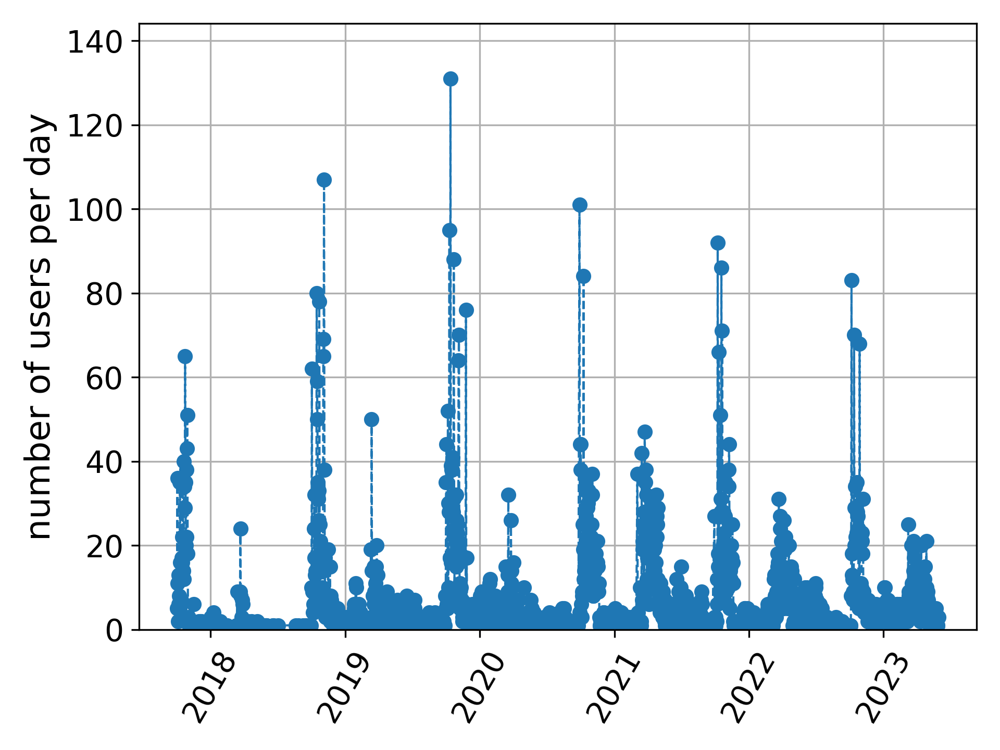

## A Telegram bot that allows you to simulate linear circuits

### Analysis performed
Currently, SpicePyBot has been used by 1179 users for a total of 15254 analysis. Fig. 1 shows the percentages of the different analysis (`.op` = operating point, `.tran` = transient, `.ac` = alternatig current).

Fig. 1 - analysis performed with SpicePyBot

### Usage during time
SpicePyBot is used since 2017. Fig. 2 shows the increse uf users during time whereas Fig. 3 the increase of analyses.

Fig. 2 - increase of users

Fig. 3 - increase of analyses

### Usage day-by-day
In the following one can see the daily usage of the bot (Fig. 4 and Fig. 5).

Fig. 4 - active user per day

Fig. 5 - analysis per day

