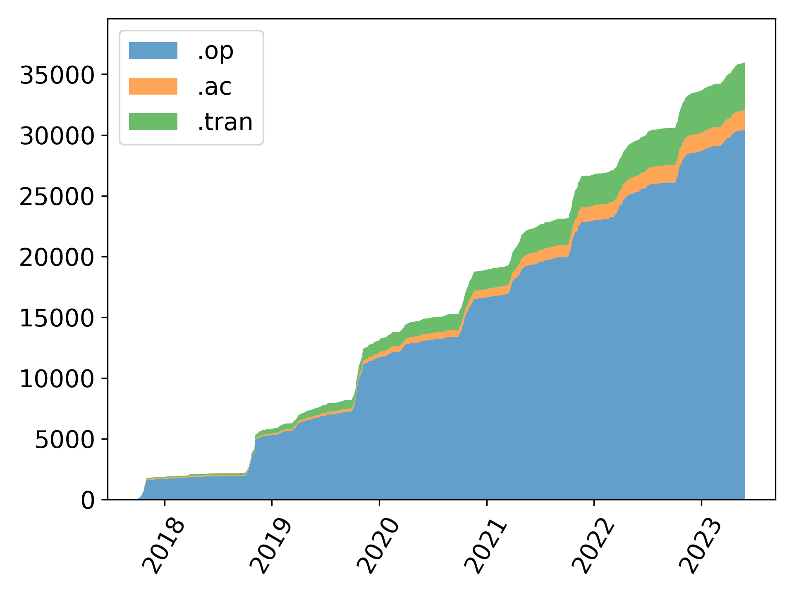
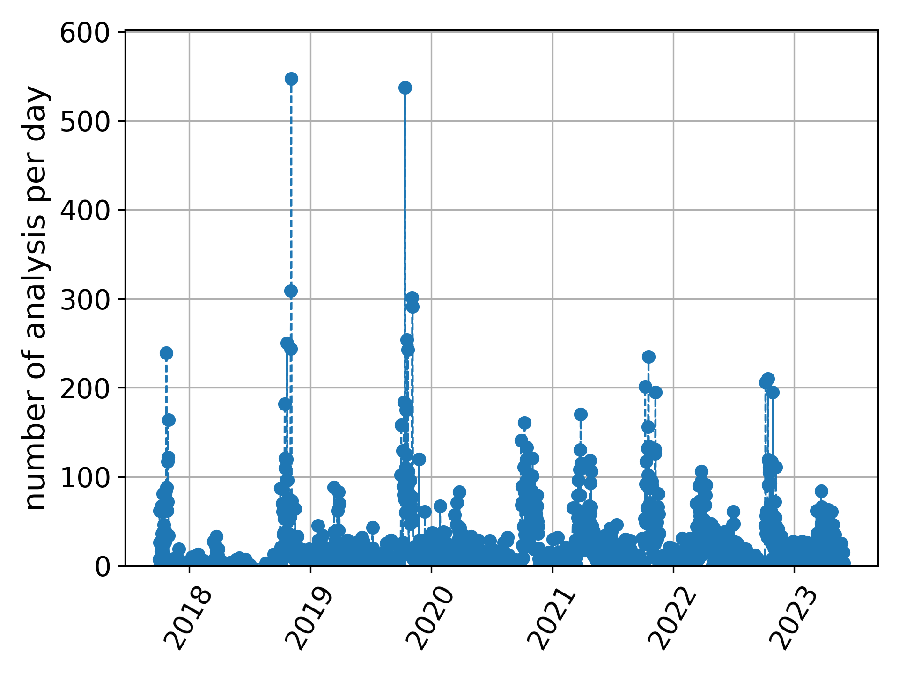

## Here you can read some usage statistic of SpicePyBot (July 10, 2020)

**SpicePyBot** is a Telegram bot that allow you to simulate linear circuits. It is used mainly in classroom since semtember 2017.

**Link to the source code -->** [here](https://github.com/giaccone/SpicePyBot)

**Link to the documentation -->** [here](https://github.com/giaccone/SpicePyBot/wiki).

### Analysis performed
Currently, SpicePyBot has been used by 1171 users for a total of 15164 analysis. Fig. 1 shows the percentages of the different analisys (`.op` = operating point, `.tran` = transient, `.ac` = alternatig current).

Fig. 1 - analysis performed with SpicePyBot

### Usage during time
SpicePyBot is used since 2017. Fig. 2 shows the increse uf users dirung time whereas Fig. 3 the increase of analyses.

Fig. 2 - increase of users

Fig. 3 - increase of analyses

### Usage day-by-bay
In the following one can se the daily usage of the bot (Fig. 4 and Fig. 5).

Fig. 4 - active user per day

Fig. 5 - analysis per day

